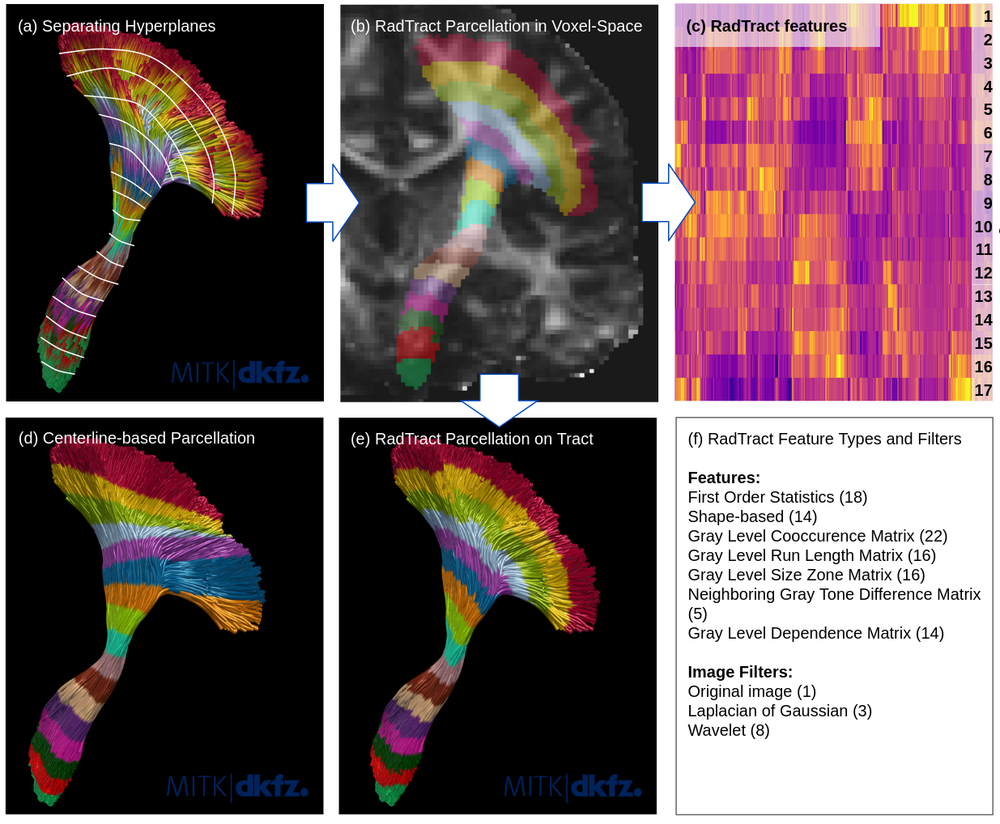

<!--
Copyright © 2023 German Cancer Research Center (DKFZ), Division of Medical Image Computing

SPDX-License-Identifier: Apache-2.0
-->

# Radiomic Tractometry (RadTract)

Copyright © German Cancer Research Center (DKFZ), [Division of Medical Image Computing (MIC)](https://www.dkfz.de/en/mic/index.php). Please make sure that your usage of this code is in compliance with the code [license](https://github.com/MIC-DKFZ/radtract/blob/master/LICENSE).

If you use RadTract, please cite our paper: `P. Neher, D. Hirjak, K. Maier-Hein. "Radiomic tractometry: a rich and tract-specific class of imaging biomarkers for neuroscience and medical applications", May 23, 2023. doi: https://doi.org/10.1101/2021.05.23.21257610`

## Overview

Python package for radiomic tractometry (RadTract).
RadTract enables the extraction of comprehensive and highly informative microstructural feature sets along individual white matter tracts suitable for subject-level predictions, where classic tractometry is limited to a vector of mean values per tract. 

For details about the approach, please refer to our paper [Radiomic tractometry: a rich and tract-specific class of imaging biomarkers for neuroscience and medical applications](https://doi.org/10.21203/rs.3.rs-2950610/v1).
An overview of the method is shown in Figure 1.

_Figure 1: Illustration of the complete RadTract process. The points of a statically resampled tract (a) can be seen as samples of partly overlapping classes that are not linearly separable. We are aiming at finding the hyperplanes, superimposed as white lines on the tract in (a), that optimally separate the classes with the smallest amount of errors. This task can be solved using large-margin classifiers such as SVMs. This enables us to create parcellations directly in voxel-space (b) that do not suffer from projection-induced misassignments, as is the case in the centerline-based approach (d). For visualization purposes, the tract parcellation in voxel-space is projected back on the original streamlines (e). The proposed tract parcellation in voxel-space (b) is used to calculate 1106 features per parcel, visualized in (c). In the case of the CST example used in this figure, this results in 18,802 features for the complete tract. The calculated feature classes and used image filters are listed in (f). Figure from [Radiomic tractometry: a rich and tract-specific class of imaging biomarkers for neuroscience and medical applications](https://doi.org/10.21203/rs.3.rs-2950610/v1)._

## Installation

### Requirements

- No specific hardware requirements. A state-of-the-art desktop computer should be sufficient.
- Tested on Ubuntu 22.04 but should run on other systems as well.
- Tested with Python 3.8 and higher
- Numpy should be installed prior to the RadTract setup, all other dependencies will be installed automatically. 
- It is recommended to use a virtual environment for the installation. 

See `.gitlab-ci.yml` for the currently tested configurations.

### Installation

1. virtual environment
   - Create a virtual environment: `python -m venv myvenv`
   - Activate the virtual environment: `source myvenv/bin/activate`
2. Installation
   - Install from source: navigate to the root directory of RadTract and run `pip install .`
   - Install from PyPI: run `pip install radtract`

Installation should complete within a few seconds.

## Example usage

### Python interface
See `tests\test_radtract.py` for examples of how to use RadTract in your python code. Test data is included in `tests\test_data`.

### Command line interface
RadTract can be used from the command line. Available commands:

1. `radtract_tdi`: Calculates tract density images (TDI) as well as binary tract envelopes from a tractogram and a reference image.
2. `radtract_parcellate`: Calculates tract parcellation of a tract.
3. `radtract_features`: Calculates RadTract features of a parameter map, e.g. FA, using a given tract parcellation.

Type `radtract_XYZ -h` for a list of available options.

### Expected runtimes

All tests should complete within a couple of minutes on a standard desktop computer.
